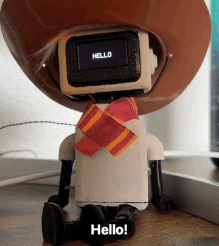
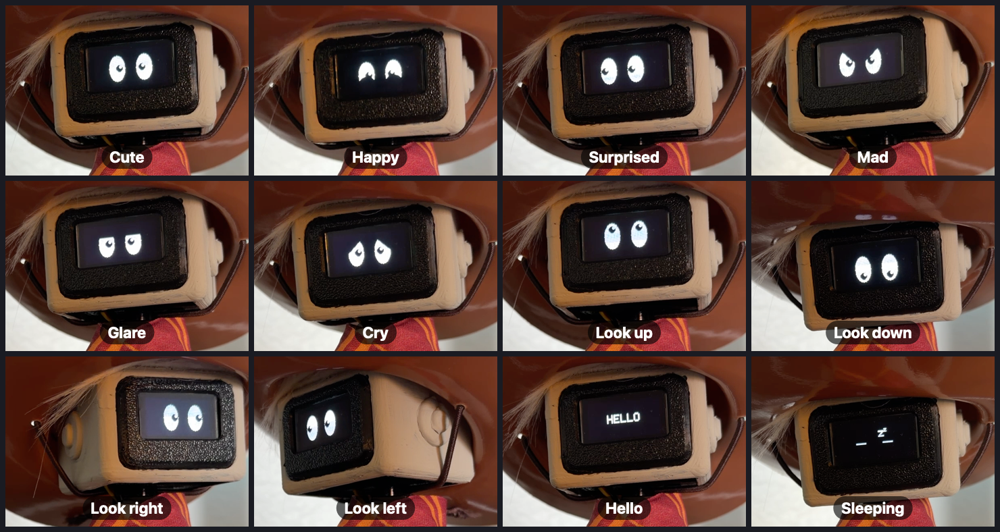

# 3D-Printed Desk Companion

A small, cute desk robot in the spirit of Cozmo / Vector — a 3D-printed body with a
cowboy hat and scarf, an OLED "face" for expressive eyes, and two servos that let it
look around, nod, and react. It lives on the desk, cycles through moods, says hello,
waves goodbye, and takes a nap every couple of minutes.

<p align="center">
  
</p>

## Expressions

<p align="center">
  
</p>

| Mood | Eyes (OLED) | Body |
|---|---|---|
| Cute (default) | Round eyes, cross-eyed pupils, sparkles | Gentle idle sway |
| Happy | Top-crescent squint | Two soft nods |
| Surprised | Wide eyes, tiny pupils | Head up |
| Mad | V-brows | Head up, small neck twitches |
| Glare | Flat hooded lids | Slow side-to-side scan |
| Cry | Λ-brows (outer corners drop) | Head lowered, sob dips |
| Curious / Confused | Raised pupils / mismatched pupils | Neck tilt |
| Look left / right / up / down | Whole eye shifts with the look | Neck or head turns (look up is eyes-only) |
| Hello / Bye | Text | — |
| Sleeping | Closed-line eyes with floating Z's, breathing bob | Still, servos relaxed |

## How it behaves

```
 ┌──────────── 60 s active window ────────────┐
 │  3 mood "buckets" in random order:          │
 │   • Upbeat  – looks, happy, curious, surprised
 │   • Upset   – looks, mad, cry, glare        │
 │   • Calm    – just looking around           │
 │  each expression is held 3–5 s with small   │──► BYE ──► 30 s sleep (Z's) ──► HELLO ──┐
 │  "alive" micro-motions, then 2–3 blinks     │                                          │
 └─────────────────────────────────────────────┘◄─────────────────────────────────────────┘
```

Everything is randomised (bucket order, expression order, hold times, blink gaps), so it
never looks like the same loop twice.

## Hardware

| Part | Notes |
|---|---|
| Arduino Uno / Nano | ATmega328P |
| SSD1306 128×64 OLED (I²C, `0x3C`) | SDA → A4, SCL → A5 |
| Servo — **head** (up/down) | D6 · 60–90° hard limits, 70–84° used, rest 80° |
| Servo — **neck** (left/right) | D9 · 0–70° hard limits, 8–62° used, rest 35° |
| 5 V wall adapter | Servos + logic; a bulk capacitor (~1000 µF+) across the servo supply helps a lot |
| 3D-printed body, head, hat, scarf | Printed on an Elegoo Neptune |

Libraries: `Adafruit_SSD1306`, `Adafruit_GFX`, `Servo`, `EEPROM`, `Wire`.

## Firmware

Sketch: [`firmware/Robot_code/Robot_code.ino`](firmware/Robot_code/Robot_code.ino) — open it
in the Arduino IDE, pick **Arduino Uno** (or Nano), and upload.

It went through several rounds of tuning from long video recordings of the robot, so the
servo code is written to be gentle on a small 5 V supply:

- **Soft, sequential motion** — only one servo moves at a time, every move eases in/out,
  and tiny twitches below a few degrees are skipped.
- **Head never goes limp** — with the hat on, an unpowered head drops under its own
  weight, and both the drop and the snap back up caused brown-out resets. Only the neck
  relaxes during sleep. At boot the head is attached where it has drooped to and lifted
  slowly instead of snapping to position.
- **Safe attach/detach** — `write()` before `attach()` (no default 90° pulse), and the
  signal pin is forced LOW after `detach()` (the AVR Servo library can otherwise leave it
  stuck HIGH, driving the servo into its end stop).
- **Built-in reset diagnostics** — a breadcrumb in `.noinit` RAM records which behaviour
  was running. After an unexpected reset the OLED shows `RESET #n`, the behaviour it
  happened in, and whether it was moving or holding; a normal plug-in shows `POWER ON`.
  The last reset is also kept in EEPROM.

> The demo clips were recorded on an earlier firmware revision, so a few moves (for
> example "look up", which used to tilt the head) differ slightly from the current code.

## Repo layout

```
firmware/Robot_code/Robot_code.ino   Arduino sketch
media/demo.gif                       demo animation (README)
media/expressions.png                expression gallery (README)
```
